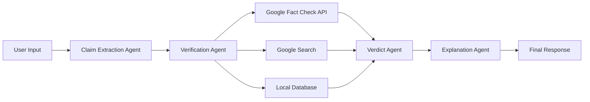

# FactCheckit — AI-powered Crisis News & Claim Verification Tool

<div align="center">

**Built for Mumbai Hacks 2025**

A simple, clean, user-friendly web application where users can paste any news headline or claim and instantly see whether it's TRUE, FALSE, MISLEADING, or UNVERIFIED.

**🚀 Powered by 100% AI - No Hardcoded Database! 🚀**

**Real-time Web Search + Intelligent AI Analysis = Latest News Verification**

</div>

---

## 🚀 QUICK START (5 Minutes)

### Step 1: Get Gemini API Key
1. Visit: https://makersuite.google.com/app/apikey
2. Sign in and click "Create API Key"
3. Copy your API key

### Step 2: Setup Backend

```powershell
# Navigate to backend
cd backend

# Install dependencies
pip install -r requirements.txt

# Create .env file
copy .env.example .env

# Edit .env and add your API key
notepad .env
# Add: GEMINI_API_KEY=your_api_key_here
# Optional: GOOGLE_SEARCH_ENGINE_ID=your_search_id (for Google Search)
# Optional: NEWS_API_KEY=your_news_key (from newsapi.org)

# Start backend
python -m uvicorn app.main:app --reload --host 127.0.0.1 --port 8000
```

✅ Backend at: http://localhost:8000 | API Docs: http://localhost:8000/docs

### Step 3: Setup Frontend (New Terminal)

```powershell
# Navigate to frontend
cd frontend

# Install dependencies
npm install

# Create environment file
copy .env.local.example .env.local

# Start frontend
npm run dev
```

✅ Frontend at: http://localhost:3000

### Step 4: (Optional) Setup Telegram Bot

Want to verify claims via Telegram chat? Follow these steps:

#### 4.1: Create Telegram Bot

1. **Open Telegram** (on your phone or desktop)
2. **Search for `@BotFather`** (official bot creation bot)
3. **Send `/newbot`** command
4. **Follow the prompts:**
   - Enter bot display name (e.g., "FactCheckit Bot")
   - Enter bot username (must end with 'bot', e.g., "factcheckit_xyz_bot")
   - **Important:** Username must be unique across all Telegram!
5. **Copy the API token** you receive (looks like: `123456789:ABCdefGHIjklMNOpqrsTUVwxyz`)
6. **Save this token** - you'll need it in the next step!

💡 **Tip:** Keep the chat with @BotFather open - you can always retrieve your token by sending `/mybots` → Select your bot → API Token

#### 4.2: Install Telegram Bot Dependencies

```powershell
# Navigate to backend directory
cd backend

# Install python-telegram-bot library (if not already installed)
pip install python-telegram-bot==21.0.1

# Verify installation
pip show python-telegram-bot
```

✅ Should show version 21.0.1 installed

#### 4.3: Configure Bot Token

```powershell
# Edit backend/.env file
notepad backend/.env

# Add this line (replace with your actual token from @BotFather):
TELEGRAM_BOT_TOKEN=123456789:ABCdefGHIjklMNOpqrsTUVwxyz

# Save and close the file
```

**Your .env file should now look like:**
```env
GEMINI_API_KEY=your_gemini_key_here
TELEGRAM_BOT_TOKEN=123456789:ABCdefGHIjklMNOpqrsTUVwxyz
# Optional:
# GOOGLE_SEARCH_ENGINE_ID=your_search_id
# NEWS_API_KEY=your_news_key
```

#### 4.4: Run the Telegram Bot

```powershell
# Make sure you're in backend directory
cd backend

# Activate virtual environment (if using one)
.\.venv\Scripts\Activate.ps1  # Windows PowerShell
# OR: source .venv/bin/activate  # Mac/Linux

# Run the bot
python -m app.bots.telegram_bot
```

**You should see:**
```
🤖 Starting FactCheckit Telegram Bot...
✅ Bot is running! Press Ctrl+C to stop.
```

✅ **Bot is now live!** Keep this terminal open - the bot runs continuously

#### 4.5: Test Your Telegram Bot

1. **Open Telegram** (mobile or desktop)
2. **Search for your bot** using the username you created (e.g., `@factcheckit_xyz_bot`)
3. **Start a chat** with your bot
4. **Send `/start`** - You'll get a welcome message with instructions
5. **Send any claim** to verify it!

**Example Conversation:**
```
You: /start

Bot: 🔍 Welcome to FactCheckit Bot!

     I help you verify claims using AI and multiple trusted sources including:
     🇮🇳 Indian fact-checkers (PIB, Alt News, BOOM, Factly, Vishvas News)
     🌐 Google Fact Check API & Web Search
     🤖 AI-powered analysis with Google Gemini
     
     Just send me any text, article, or claim you want to verify!

You: The Indian government announced free internet for all citizens

Bot: 🔍 Analyzing your claim...
     🔍 Step 1/4: Extracting claims with AI...
     🔍 Step 2/4: Verifying with Indian fact-checkers...
     🔍 Step 3/4: AI analyzing all sources...
     🔍 Step 4/4: Generating detailed explanation...
     
     ❌ Verdict: FALSE
     📊 Confidence: 85.3%
     
     Claim:
     Indian government announced free internet for all citizens
     
     Summary:
     This claim is false. No such announcement has been made...
     
     Detailed Analysis:
     [Shows detailed explanation with sources]
     
     Sources Checked:
     🇮🇳 2 Indian fact-checkers
     📰 10 total sources
     
     Verified by FactCheckit AI
```

#### 4.6: Available Bot Commands

- **`/start`** - Welcome message and bot introduction
- **`/help`** - Detailed help and usage instructions
- **`/about`** - Learn about FactCheckit project
- **Just send any text** - Automatically verifies the claim!

#### 4.7: Stopping the Bot

To stop the bot:
1. Go to the terminal where bot is running
2. Press **`Ctrl+C`**
3. Bot will shut down gracefully

To restart:
```powershell
cd backend
python -m app.bots.telegram_bot
```

#### 4.8: Troubleshooting Telegram Bot

**Bot not responding?**
```powershell
# Check if bot is running in terminal
# You should see "✅ Bot is running! Press Ctrl+C to stop."

# If not running, check for errors:
cd backend
python -m app.bots.telegram_bot

# Common errors:
```

**Error: "No module named 'telegram'"**
```powershell
pip install python-telegram-bot==21.0.1
```

**Error: "TELEGRAM_BOT_TOKEN not found"**
- Check your `.env` file has the token
- Make sure there are no extra spaces
- Token format: `TELEGRAM_BOT_TOKEN=123456789:ABCdef...`

**Error: "Unauthorized"**
- Your bot token is invalid
- Get a new token from @BotFather:
  - Send `/mybots` to @BotFather
  - Select your bot
  - Select "API Token"
  - Copy and update .env

**Error: "Conflict: terminated by other getUpdates request"**
- Another instance of your bot is running
- Stop all Python processes: `taskkill /F /IM python.exe` (Windows)
- Restart the bot

**Bot is slow?**
- First request takes 5-10 seconds (cold start)
- Subsequent requests are faster
- Check your internet connection
- Verify Gemini API key is valid

**No results from Indian fact-checkers?**
- This is normal - sites may be blocking scrapers
- Bot still works with DuckDuckGo scraper + AI analysis
- Consider adding NEWS_API_KEY for more sources

#### 4.9: Running Multiple Services Together

To run everything (backend API + Telegram bot):

**Terminal 1 - Backend API:**
```powershell
cd backend
python -m uvicorn app.main:app --reload
```

**Terminal 2 - Telegram Bot:**
```powershell
cd backend
python -m app.bots.telegram_bot
```

**Terminal 3 - Frontend (optional):**
```powershell
cd frontend
npm run dev
```

Now you can:
- ✅ Access web UI at http://localhost:3000
- ✅ Use Telegram bot for instant verification
- ✅ Both use the same backend logic!

### Step 5: Test It!

1. Open: http://localhost:3000
2. Paste: `Virat Kohli announces retirement from all formats`
3. Click "Verify Claim"
4. See AI-powered results with Indian fact-checkers! 🇮🇳 🎉

**OR** Test via Telegram Bot:
1. Message your bot on Telegram
2. Send any claim
3. Get instant verification! 💬

---

## 🎯 Purpose

Help people understand real verified news during crises by using:
- **Google Gemini 2.5 Flash AI** - Latest AI model for intelligent analysis
- **🇮🇳 Indian Fact-Checkers** - PIB, Alt News, BOOM Live, Factly, Vishvas News
- **Web Scraping** - DuckDuckGo search (works without API setup!)
- **Google Fact Check Tools API** - Optional for enhanced accuracy
- **Google Custom Search API** - Optional for more sources
- **NewsAPI** - Optional for latest news articles
- **Telegram Bot** - Chat interface for instant verification
- **100% AI-powered verification** - NO hardcoded database!

## ✨ Features

### Frontend (Next.js + TailwindCSS)
- 🎨 **Beautiful UI**: Clean, centered, minimalistic design
- 📱 **Responsive**: Mobile-friendly interface
- ⚡ **Fast**: Optimized with Next.js 14
- 🎯 **Color-coded Results**: Easy-to-understand verdict badges
  - 🟢 TRUE (green)
  - 🔴 FALSE (red)
  - 🟡 MISLEADING (yellow)
  - ⚪ UNVERIFIED (gray)

### Backend (FastAPI + Gemini AI)
- 🤖 **100% AI-Powered**: NO hardcoded facts - all verdicts from real-time AI analysis
- 🇮🇳 **Indian Fact-Checkers**: Integrated with 5 trusted Indian sources
  - PIB Fact Check (Govt. of India)
  - Alt News (Award-winning independent)
  - BOOM Live (Leading fact-checker)
  - Factly (South Indian focus)
  - Vishvas News (PIB multilingual initiative)
- 🕷️ **Web Scraping**: Automatically scrapes DuckDuckGo for latest news (no API needed!)
- 🧠 **Intelligent Research**: Gemini AI reads and understands web content
- 🔍 **Multi-Source Verification**: Combines fact-checkers, search engines, and news APIs
- 📊 **Smart Verdict**: AI weighs evidence and provides confidence scores
- 💡 **Human-Friendly**: Clear explanations with source citations
- 💬 **Telegram Bot**: Chat interface for instant fact-checking
- ⚡ **Works Without APIs**: Web scraper as fallback when APIs fail

## 🛠️ Tech Stack

### Frontend
- Next.js 14 (React framework)
- Tailwind CSS 4 (Styling)
- Axios (API requests)

### Backend
- **FastAPI** - High-performance Python web framework
- **Google Gemini 2.5 Flash** - Latest AI model for analysis
- **BeautifulSoup4** - Web scraping for DuckDuckGo
- **aiohttp** - Async HTTP requests
- **Optional APIs**: Google Fact Check, Custom Search, NewsAPI

## 📁 Project Structure

```
factcheckit/
│
├── frontend/                     # Next.js 14 (UI)
│   ├── app/
│   │   ├── page.js              # Main page
│   │   ├── layout.js            # Root layout
│   │   └── globals.css          # Global styles
│   ├── components/
│   │   ├── VerificationForm.js  # Form component
│   │   ├── ResultCard.js        # Results display
│   │   └── Loader.js            # Loading animation
│   ├── lib/
│   │   └── api.js               # API client
│   ├── styles/
│   │   └── custom.css           # Custom styles
│   └── package.json
│
└── backend/                      # FastAPI + Gemini Agents
    ├── app/
    │   ├── main.py              # FastAPI entry point
    │   ├── routers/
    │   │   └── verify.py        # /api/verify endpoint
    │   ├── agents/              # AI logic (5 agents)
    │   │   ├── extractor_agent.py      # Extract claims
    │   │   ├── verification_agent.py   # Orchestrate verification
    │   │   ├── research_agent.py       # AI analyzes web results
    │   │   ├── verdict_agent.py        # Determine verdict
    │   │   └── explanation_agent.py    # Generate explanations
    │   ├── tools/               # Verification Tools
    │   │   ├── google_factcheck.py     # Fact Check API (optional)
    │   │   ├── google_search.py        # Custom Search API (optional)
    │   │   ├── web_scraper.py          # DuckDuckGo scraper + NewsAPI
    │   │   └── indian_factcheckers.py  # 🇮🇳 5 Indian fact-checkers
    │   ├── bots/                # Chat interfaces
    │   │   └── telegram_bot.py         # Telegram bot
    │   ├── models/
    │   │   ├── request_model.py
    │   │   └── response_model.py
    │   └── utils/
    │       ├── preprocess.py
    │       └── similarity.py
    ├── requirements.txt
    └── .env
```

## 📝 DETAILED SETUP GUIDE

### Prerequisites
- Python 3.8+
- Node.js 18+
- Google Gemini API Key ([Get it here](https://makersuite.google.com/app/apikey))

### Backend Details

**Dependencies (requirements.txt):**
- FastAPI 0.109.0
- Uvicorn 0.27.0
- Google Generative AI 0.3.2
- python-telegram-bot 21.0.1 (for Telegram bot)
- aiohttp 3.9.1
- BeautifulSoup4 4.12.2 (web scraping)
- lxml 5.1.0 (HTML parsing)
- httpx 0.28.1 (HTTP client)
- python-dotenv 1.0.0

**Environment Variables (.env):**
```env
# Required (Only 1 key needed!)
GEMINI_API_KEY=your_gemini_api_key

# Optional - For Telegram Bot
TELEGRAM_BOT_TOKEN=your_telegram_bot_token  # From @BotFather on Telegram

# Optional - For Enhanced Features
GOOGLE_SEARCH_ENGINE_ID=your_search_engine_id  # From programmablesearchengine.google.com
NEWS_API_KEY=your_news_api_key                 # From newsapi.org (100 free/day)

# Note: Google APIs use same GEMINI_API_KEY above
# App works with ONLY Gemini key using web scraper + Indian fact-checkers!
```

**Running Backend:**
```powershell
cd backend
pip install -r requirements.txt
python -m uvicorn app.main:app --reload --host 127.0.0.1 --port 8000
```

### Frontend Details

**Dependencies:**
- Next.js 16.0.5
- React 19.2.0
- Axios 1.13.2
- Tailwind CSS 4

**Environment Variables (.env.local):**
```env
NEXT_PUBLIC_API_URL=http://127.0.0.1:8000
```

**Running Frontend:**
```powershell
cd frontend
npm install
npm run dev
```

## 🎯 How It Works

### User Experience

1. **User visits the website** → Clean, beautiful interface
2. **Pastes a news headline** → Simple text input
3. **Clicks "Verify Claim"** → AI processing begins
4. **Receives instant verdict** → Color-coded result with explanation

### Backend Processing Flow



#### Step-by-Step:

1. **Claim Extraction Agent** (Gemini AI)
   - Converts user input into a clean factual statement
   - Removes bias, opinions, and emotional language

2. **Verification Agent**
   - Parallel checking across multiple sources:
     - 🇮🇳 Indian Fact-Checkers (PIB, Alt News, BOOM, Factly, Vishvas News)
     - DuckDuckGo Web Scraper (no API needed!)
     - Google Fact Check Tools API (optional)
     - Google Custom Search (optional)
     - NewsAPI for latest articles (optional)

3. **Research Agent** (NEW!)
   - Uses Gemini AI to analyze search results
   - Reads and understands web content
   - Makes intelligent verdicts based on evidence
   - Works even when APIs are unavailable

4. **Verdict Agent**
   - Combines AI analysis with fact-checker data
   - Weighs evidence from multiple sources
   - Calculates confidence score
   - Determines verdict: TRUE/FALSE/MISLEADING/UNVERIFIED

5. **Explanation Agent** (Gemini AI)
   - Generates human-friendly summary
   - Creates 2-3 evidence points with sources
   - Provides detailed explanations
   - Shows AI reasoning process

## 📸 Usage

### Example 1: False Claim

**Input**: "Scientists have discovered a cure for all types of cancer"

**Output**:
- 🔴 **FALSE** verdict
- **Real News**: While there have been significant advances in cancer treatment, no universal cure exists
- **Evidence**: No major scientific journals published such findings
- **Sources**: WHO, Nature Medicine, NIH

### Example 2: True Claim

**Input**: "The COVID-19 pandemic began in late 2019 in Wuhan, China"

**Output**:
- 🟢 **TRUE** verdict
- **Confirmation**: First cases identified in December 2019
- **Evidence**: Confirmed by WHO and CDC
- **Sources**: WHO, CDC

### Example 3: Misleading Claim

**Input**: "Drinking water prevents all diseases"

**Output**:
- 🟡 **MISLEADING** verdict
- **Explanation**: Hydration is important, but water alone cannot prevent all diseases
- **Evidence**: Medical conditions require proper treatment
- **Sources**: Mayo Clinic, WHO

## 🚀 API Documentation

### Verify Endpoint

**POST** `/api/verify`

**Request Body**:
```json
{
  "claim": "Your news headline or claim here"
}
```

**Response**:
```json
{
  "original_claim": "Scientists have discovered a cure for cancer",
  "extracted_claim": "A complete cure for all types of cancer has been discovered",
  "verdict": "FALSE",
  "confidence_score": 0.92,
  "real_news_summary": "While there have been significant advances...",
  "detailed_explanation": "This claim is false because...",
  "evidence_points": [
    {
      "point": "No major scientific journal has published...",
      "source": "Nature Medicine"
    }
  ],
  "sources": [
    {
      "title": "Cancer Research Progress",
      "url": "https://example.com",
      "publisher": "WHO"
    }
  ],
  "agent_reasoning": "Verified through multiple sources"
}
```

## 🧪 TEST CLAIMS (Try These!)

### Current News Claims:
- `Virat Kohli announces retirement from all formats`
- `MS Dhoni becomes India's new Test captain`
- `India wins World Cup 2024`
- `Tesla stock reaches $1000`
- `Scientists discover cure for all cancers`

### Classic False Claims:
- `COVID-19 vaccines contain microchips`
- `5G technology causes COVID-19`
- `The Earth is flat`
- `Climate change is a hoax`

**Note:** App now uses real-time web search - test with any recent news!

## 🐛 TROUBLESHOOTING

### Backend Issues

**"Module not found" error:**
```powershell
cd backend
pip install -r requirements.txt
```

**"404 models/gemini-2.5-flash not found":**
- Check your GEMINI_API_KEY in .env
- Verify API key at: https://makersuite.google.com/app/apikey

**Port 8000 already in use:**
```powershell
# Use different port
python -m uvicorn app.main:app --reload --host 127.0.0.1 --port 8001
# Update frontend .env.local: NEXT_PUBLIC_API_URL=http://127.0.0.1:8001
```

### Frontend Issues

**Port 3000 in use:**
- Frontend will auto-use port 3001
- Just open http://localhost:3001

**"Network Error" when verifying:**
- Ensure backend is running at http://127.0.0.1:8000
- Check browser console for CORS errors
- Verify .env.local has correct API URL

**Components not found:**
```powershell
cd frontend
npm install
```

### API Returns "UNVERIFIED"

This is normal if:
1. No search results found (very obscure claim)
2. Web scraper blocked by site
3. Gemini AI couldn't find strong evidence
4. Claim is too recent (within last few hours)

**Solution:** 
- Try different claims
- Check backend terminal for scraper status
- Enable Google APIs for better results
- Wait a few minutes if news is very recent

## 🎨 CUSTOMIZATION

### Enable NewsAPI (100 Free Requests/Day)

1. Get free key: https://newsapi.org/register
2. Add to `.env`: `NEWS_API_KEY=your_key`
3. Restart backend
4. Get latest news articles automatically!

### Enable Google Custom Search

1. Create search engine: https://programmablesearchengine.google.com/
2. Get Search Engine ID (cx parameter)
3. Add to `.env`: `GOOGLE_SEARCH_ENGINE_ID=your_id`
4. Enable API: https://console.developers.google.com/apis/api/customsearch.googleapis.com
5. Restart backend

### Changing UI Colors

Edit `frontend/components/ResultCard.js` in `getVerdictStyle()` function.

### Modifying AI Prompts

- **Claim Extraction**: `backend/app/agents/extractor_agent.py`
- **Explanations**: `backend/app/agents/explanation_agent.py`

## 📊 API DOCUMENTATION

### Main Endpoint

**POST** `/api/verify`

**Request:**
```json
{
  "claim": "Your news headline or claim"
}
```

**Response:**
```json
{
  "original_claim": "...",
  "extracted_claim": "...",
  "verdict": "FALSE",
  "confidence_score": 0.92,
  "real_news_summary": "...",
  "detailed_explanation": "...",
  "evidence_points": [
    {"point": "...", "source": "..."}
  ],
  "sources": [
    {"title": "...", "url": "...", "publisher": "..."}
  ],
  "agent_reasoning": "..."
}
```

**Interactive Docs:** http://localhost:8000/docs

## 💬 TELEGRAM BOT

FactCheckit now has a Telegram bot for instant fact-checking via chat!

### Features
- ✅ **Instant Verification**: Send any claim via Telegram
- 🇮🇳 **Indian Sources**: Uses all 5 Indian fact-checkers
- 🤖 **AI-Powered**: Gemini AI analyzes results
- 📊 **Detailed Results**: Verdict, confidence, sources, explanation
- 🚀 **Real-time**: Get results in seconds
- 💡 **User-Friendly**: Simple chat interface

### Commands

- `/start` - Welcome message and instructions
- `/help` - Show help and how to use
- `/about` - Learn about FactCheckit

Just send any text to verify a claim!

### Setup Instructions

1. **Create Bot with @BotFather:**
   - Open Telegram, search `@BotFather`
   - Send `/newbot`
   - Choose name and username
   - Copy API token

2. **Add Token to .env:**
   ```env
   TELEGRAM_BOT_TOKEN=123456789:ABCdefGHIjklMNOpqrsTUVwxyz
   ```

3. **Install Dependencies:**
   ```powershell
   cd backend
   pip install python-telegram-bot==21.0.1
   ```

4. **Run Bot:**
   ```powershell
   python -m app.bots.telegram_bot
   ```

5. **Test:**
   - Find your bot on Telegram
   - Send `/start`
   - Send any claim to verify!

### Example Usage

```
User: India wins World Cup 2024
Bot:  🔍 Analyzing your claim...
      
      ❌ Verdict: FALSE
      📊 Confidence: 87.5%
      
      Claim:
      India wins Cricket World Cup in 2024
      
      Analysis:
      This claim is false. The 2024 Cricket World Cup has not occurred yet.
      India last won the ODI World Cup in 2011...
      
      Sources Checked:
      🇮🇳 3 Indian fact-checkers
      📰 8 total sources
```

### Bot Architecture

The bot uses the same verification pipeline as the web app:
1. Extract claims (Gemini AI)
2. Search Indian fact-checkers
3. Search web sources
4. AI analysis (Gemini)
5. Determine verdict
6. Generate explanation

**Processing Time:** 5-10 seconds per claim

### Troubleshooting

**Bot not responding:**
- Check TELEGRAM_BOT_TOKEN in .env
- Verify bot is running (should see "✅ Bot is running!")
- Try `/start` command

**"Unauthorized" error:**
- Token is invalid
- Get new token from @BotFather

**Slow responses:**
- Normal for first request (cold start)
- Check internet connection
- Verify backend is running

## 🚀 DEPLOYMENT

### Backend (FastAPI)
- Deploy to: Render, Railway, Fly.io, or any Python host
- Set environment variable: `GEMINI_API_KEY`
- Use production server: `gunicorn -w 4 -k uvicorn.workers.UvicornWorker app.main:app`

### Frontend (Next.js)
- Deploy to: Vercel (recommended), Netlify, or Cloudflare Pages
- Set environment variable: `NEXT_PUBLIC_API_URL=your_backend_url`
- Build command: `npm run build`
- Start command: `npm start`

## 📁 COMPLETE FILE STRUCTURE

```
factcheckit/
├── README.md (this file)
├── .gitignore
│
├── backend/
│   ├── app/
│   │   ├── main.py (FastAPI app)
│   │   ├── routers/verify.py (API endpoint)
│   │   ├── agents/ (4 AI agents)
│   │   │   ├── extractor_agent.py
│   │   │   ├── verification_agent.py
│   │   │   ├── verdict_agent.py
│   │   │   └── explanation_agent.py
│   │   ├── tools/ (Verification tools)
│   │   │   ├── google_factcheck.py
│   │   │   ├── google_search.py
│   │   │   └── local_db.py
│   │   ├── models/ (Data schemas)
│   │   ├── utils/ (Text processing)
│   │   └── data/facts.json (10 facts)
│   ├── requirements.txt
│   └── .env
│
└── frontend/
    ├── app/
    │   ├── page.js (Main UI)
    │   ├── layout.js
    │   └── globals.css
    ├── components/
    │   ├── VerificationForm.js
    │   ├── ResultCard.js
    │   └── Loader.js
    ├── lib/api.js
    ├── package.json
    └── .env.local
```

## 🎯 HOW IT WORKS

1. **User Input** → Paste any claim or news headline (web or Telegram)
2. **Claim Extraction** → Gemini AI extracts clean factual statement
3. **Multi-Source Verification** → Parallel searches:
   - 🇮🇳 **Indian Fact-Checkers** (PIB, Alt News, BOOM, Factly, Vishvas) - **Prioritized!**
   - 🕷️ **DuckDuckGo Web Scraper** (always works, no API!)
   - 📰 **NewsAPI** (if configured - latest news)
   - ✓ **Google Fact Check** (if configured - verified claims)
   - 🔍 **Google Search** (if configured - more sources)
4. **AI Analysis** → Gemini reads and analyzes all search results (especially Indian sources)
5. **Smart Verdict** → AI weighs evidence and determines TRUE/FALSE/MISLEADING
6. **Explanation** → Gemini generates human-friendly summary with sources
7. **Display** → Color-coded results with confidence score (web UI or Telegram bot)

## 📝 License

MIT License

## 👥 Team

Built for **Mumbai Hacks 2025**

---

<div align="center">

### ✨ Your FactCheckit is Ready! ✨

**Backend:** http://localhost:8000/docs
**Frontend:** http://localhost:3000

Made with ❤️ for crisis news verification

</div>